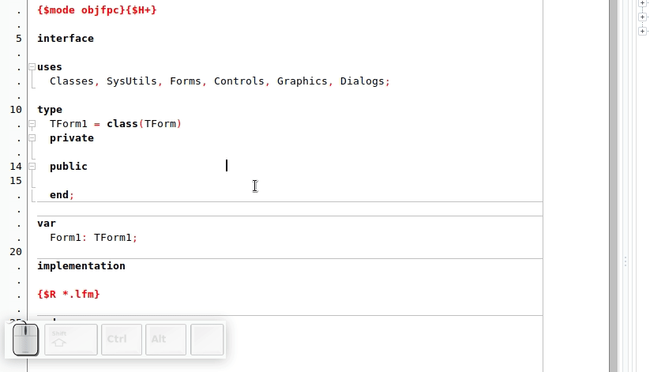

# LazCommandPalette

LazCommandPalette is an IDE-Extension for Lazarus that resembles the command palette window of the [Atom](https://atom.io/) editor. If you press **Ctrl + Shift + P** a window appears where you can see a list of commands that can be filtered by a search and executed with the **Return** key or canceled with **Escape**.

Internally it works with the commands that can be assigned to the buttons of the toolbar. So if a commmand is not working it is most likely someone else`s fault :smiley:!

# Licence

Copyright (C) 2019 by Johannes Rosleff Sörensen

This source is free software; you can redistribute it and/or modify it under
the terms of the GNU General Public License as published by the Free
Software Foundation; either version 2 of the License, or (at your option)
any later version.

This code is distributed in the hope that it will be useful, but WITHOUT ANY
WARRANTY; without even the implied warranty of MERCHANTABILITY or FITNESS
FOR A PARTICULAR PURPOSE.  See the GNU General Public License for more
details.

A copy of the GNU General Public License is available on the World Wide Web
at <http://www.gnu.org/copyleft/gpl.html>. You can also obtain it by writing
to the Free Software Foundation, Inc., 51 Franklin Street - Fifth Floor,
Boston, MA 02110-1335, USA.
